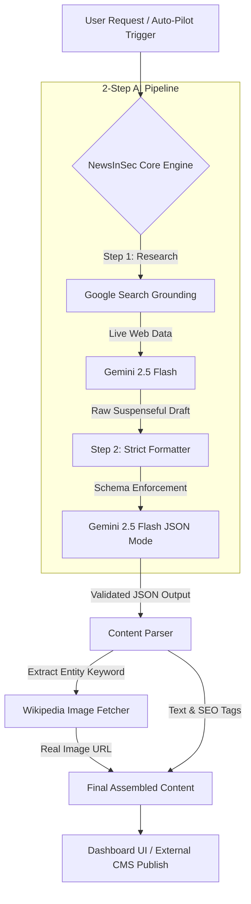

<div align="center">
  
  
  <h1>📰 NewsInSec - Viral Auto-Blogging System</h1>
  <p><strong>A Next-Generation AI-Powered Content Engine built by Ayush Kausik</strong></p>

  [](https://nextjs.org/)
  [](https://www.typescriptlang.org/)
  [](https://tailwindcss.com/)
  [](https://ai.google.dev/)
</div>

---

## 🚀 Overview

**NewsInSec** is an enterprise-grade, highly scalable auto-blogging and viral content generation platform. It leverages advanced Large Language Models (LLMs) combined with real-time web search grounding to autonomously discover breaking news, generate suspenseful and highly engaging articles, source relevant real-world images, and format everything perfectly for modern web audiences.

Designed for content creators, digital marketers, and news agencies who want to scale their content production by 100x without sacrificing factual accuracy or quality.

---

## ✨ Core Features

- **🧠 Advanced AI Generation Engine**: Powered by Google's latest Gemini 2.5 Flash model. Capable of writing human-like, suspense-driven, and highly engaging news articles.
- **🌍 Real-Time Google Search Grounding**: No AI hallucinations. The system performs live web searches in the background to ensure all generated content is 100% factual, accurate, and up-to-date with current global events.
- **🖼️ Automated Image Sourcing**: Intelligently extracts the core entity (e.g., a politician, tech company, or location) from the generated news story and dynamically fetches high-quality, real images from Wikipedia/Wikimedia.
- **⚡ Next.js 15 & React 19 App Router**: Built on the absolute bleeding edge of web technologies, offering server-side rendering (SSR), lightning-fast page loads, and superior SEO.
- **💅 Premium UI/UX Design**: Crafted with Tailwind CSS, Framer Motion, and shadcn/ui. Features a dark-mode first aesthetic, stunning 3D glassmorphism elements, and buttery-smooth micro-interactions.
- **🌐 Niche & Language Agnostic**: Generates content for absolutely ANY niche (Business, Crypto, Crime, Gaming, Lifestyle) and in ANY language, including localized hybrid tones like "Hinglish".
- **🔄 Auto-Pilot Mode**: A "Set & Forget" system that can run 24/7, continuously generating news, finding images, writing viral hooks, and publishing them on autopilot.

---

## 🏗️ System Architecture

NewsInSec employs a highly robust **2-Step AI Pipeline** to ensure both factual accuracy and strict JSON data structure compliance, bypassing the common formatting limitations of LLMs.



### Why the 2-Step Process?
Standard LLMs struggle to simultaneously perform live web research AND adhere to complex, strict JSON schemas. NewsInSec splits this:
1. **The Researcher:** Fetches live data via Google and writes a compelling journalistic draft.
2. **The Editor:** Takes the draft and forces it into a strict `application/json` schema, guaranteeing perfect integration with the frontend UI and database without runtime crashes.

---

## 💻 Tech Stack

- **Framework**: [Next.js 15](https://nextjs.org/) (App Router, Server Actions)
- **Language**: TypeScript (Strict typing for end-to-end type safety)
- **Styling**: [Tailwind CSS](https://tailwindcss.com/)
- **UI Components**: [shadcn/ui](https://ui.shadcn.com/) (Radix Primitives)
- **Animations**: [Framer Motion](https://www.framer.com/motion/) & Lucide Icons
- **AI Engine**: `@google/genai` (Official Google Gen AI SDK)
- **Image Sourcing**: Wikipedia REST API

---

## 🛠️ Installation & Setup

1. **Clone the repository:**
   ```bash
   git clone https://github.com/Minato95-ayu/news-in-sec.git
   cd news-in-sec
   ```

2. **Install dependencies:**
   ```bash
   npm install
   ```

3. **Configure Environment Variables:**
   Create a `.env.local` file in the root of your project. You will need a Google Gemini API Key with Search Grounding enabled.
   ```env
   GEMINI_API_KEY=your_google_gemini_api_key_here
   ```

4. **Run the Development Server:**
   ```bash
   npm run dev
   ```
   Open [http://localhost:3000](http://localhost:3000) in your browser. The application will immediately connect to the Live News preview system.

---

## 🔮 Future Roadmap (Futures)

NewsInSec is continuously evolving. Here is the roadmap for upcoming enterprise features:

- [ ] **WordPress API Integration**: 1-click automatic syncing and publishing of SEO-optimized articles directly to your existing self-hosted WordPress blogs.
- [ ] **Automated Social Media Syndication**: Instantly generate Twitter threads, LinkedIn posts, and Instagram captions based on the generated news, and post them via APIs.
- [ ] **Multi-Modal Video Generation**: Convert the generated suspenseful news scripts into short-form viral videos (TikTok/Reels/Shorts) using AI avatar and text-to-speech APIs.
- [ ] **Advanced SEO Suite**: Auto-generation of schema markup, internal linking suggestions, and LSI keyword integration.
- [ ] **Multi-Agent Research**: Deploy specialized sub-agents to verify conflicting news sources before finalizing an article, acting as an AI fact-checking room.
- [ ] **Custom Domain Edge Hosting**: Deploy the generated viral news sites directly onto the Edge network for global sub-second load times.

---

## 👨‍💻 About The Author

**Designed and Engineered by Ayush Kausik**

Built with a passion for pushing the boundaries of AI automation, web development, and digital media. NewsInSec represents the convergence of modern journalism and autonomous artificial intelligence.

---

## 💖 Support the Project

If you find this project helpful and want to support the development of more advanced AI automation tools, consider sponsoring!

- **GitHub Sponsors**: [Sponsor Minato95-ayu](https://github.com/sponsors/Minato95-ayu)
- **Buy Me a Coffee**: [buymeacoffee.com/ayushkausik](https://www.buymeacoffee.com/ayushkausik)

Your support helps keep the APIs running and funds future development of the roadmap features!

---

## 📝 License

This project is licensed under the MIT License - see the LICENSE file for details. 

<p align="center">
  <i>"The future of media is autonomous."</i>
</p>
